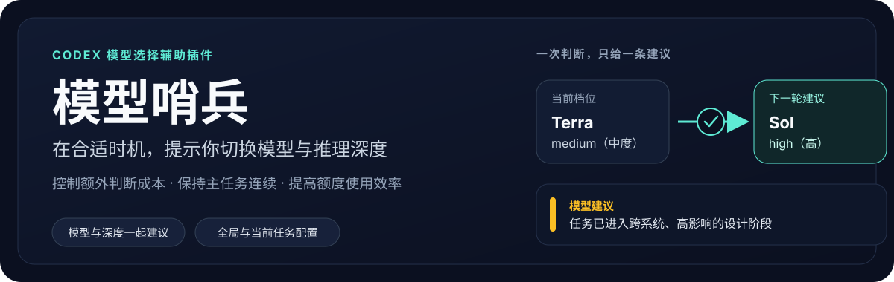
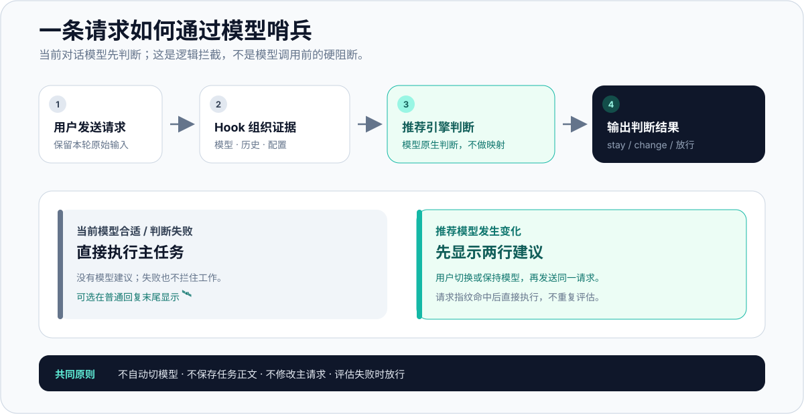
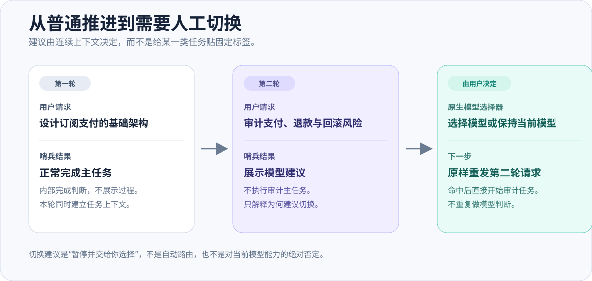

<p align="center">
  
</p>

<p align="center">Codex 的按任务模型建议插件：不替你切模型，只在需要时暂停当前任务，把决定留给你。</p>

# 模型哨兵 `v1.1.0`

模型哨兵（Model Watch）在 Codex 连续任务中复用**当前主 Agent 的模型**完成一轮轻量判断：当前模型合适时静默继续；切换能带来明确净收益时，先给出模型建议，再由用户在 Codex 原生模型选择器中决定切换或保持。

它解决的是“何时值得人工切模型”，而不是自动路由。默认按任务关闭，因此不会为每个新任务增加判断成本。

## 一期产品边界

| 已实现 | 本期不做 |
| --- | --- |
| 当前主 Agent 的同会话判断 | 子 Agent 评估器、外部评估服务 |
| 当前任务按需启用、暂停、恢复 | 自动切模型、推理深度切换 |
| `stay` 静默执行；`change` 暂停主任务 | 推荐卡片按钮、自动恢复原请求 |
| 本地记录模型元数据和请求指纹 | 保存或重放任务正文、附件 |
| 任务级状态锁与多会话隔离 | 以插件替代 Codex 原生模型选择器 |

`change` 时，用户手动选择任意模型（也可以保持不变），然后**原样重新发送同一请求**。插件以同会话请求指纹识别这次续跑，避免重复评估，并记录实际选择结果。

## 用户工作流

<p align="center">
  
</p>

1. 在需要监测的任务中发送 `!model-watch on`；这条命令只启用当前任务，不评估。
2. 下一条真实请求到达后，`UserPromptSubmit` Hook 注入当前任务状态、当前模型和候选模型。
3. 当前主 Agent 结合本轮输入、可见上下文、任务阶段、风险、协作与切换成本，记录 `stay`、`change`、`uncertain` 或 `failed`。
4. `stay`、`uncertain`、`failed` 或保存失败：直接执行主任务。通常只在回复末尾显示 `🛰️`。
5. `change`：本轮不执行主任务，只输出目标模型和简短理由。
6. 用户在 Codex 原生模型选择器中切换或保持，原样重发同一请求；匹配后直接执行，并记录采用、保持或选择其他模型。

> 这是“同会话逻辑拦截”：请求已经进入当前模型，由该模型先判断并遵守协议，因此仍会消耗一次当前模型的判断成本。它不是 Hook 在模型调用前完成的硬阻断；模型若不遵守注入协议，插件无法撤销已经开始的主任务。

## 场景实践

<p align="center">
  
</p>

### 适合保持当前模型

```text
用户：把上面三个标题统一成同一种中文格式。
结果：直接完成整理；不展示 stay 判断，回复末尾可见 🛰️。
```

### 可能建议使用更轻量模型

```text
用户：按刚才确定的格式继续整理余下 30 条文案。

模型建议：切换至 GPT-5.6 Luna 🛰️
原因：后续工作边界清晰、重复度高，轻量模型的成本收益更明确。
```

### 可能建议使用更强模型

```text
用户：继续设计登录、支付、退款和订单状态一致性，并给出异常补偿与回滚方案。

模型建议：切换至 GPT-5.6 Sol 🛰️
原因：本轮进入跨系统、高影响且需综合多项约束的设计阶段。
```

建议不是固定的“任务类型 → 模型”映射。同一句任务在不同历史、当前模型、候选模型和任务阶段下可能得到不同结论；一期先验证监控、状态与人工续跑闭环，不把某个具体切换结果当作承诺。

## 安装与首次启用

需要支持 Plugins、Hooks 和 MCP Apps 的 Codex，以及 Node.js 20+。

### 从 GitHub Marketplace 安装

```bash
codex plugin marketplace add https://github.com/shrekcg/model-watch.git
codex plugin add model-watch@model-watch
```

安装后完整重启 Codex，并在插件管理页批准 `SessionStart` 与 `UserPromptSubmit` Hook。随后在目标任务中从 `/` 菜单选择“模型哨兵”，发送：

```text
!model-watch on
```

看到“已为当前任务启用”后，再发送第一条真实请求。

### 本地开发安装

插件 MCP 使用官方 `@modelcontextprotocol/sdk` 和 `zod`，运行依赖不会提交到 Git。克隆后先安装根目录测试依赖与插件运行依赖：

```bash
npm ci
npm ci --prefix plugins/model-watch
npm run update:plugin -- --no-refresh
```

`update:plugin` 也会在更新前执行插件运行依赖安装，再复制到 Codex 插件缓存。

### `@`、`$`、`!` 与 `/` 的区别

| 形式 | 作用 |
| --- | --- |
| `/` 菜单中的“模型哨兵” | 选择插件/能力，**不**改变当前任务的开关状态 |
| `!model-watch on` | 推荐的按需启用命令，只启用当前任务 |
| `$model-watch …` | 兼容命令；可能触发宿主插件补全，不作为推荐入口 |
| `/hooks` | Codex 宿主命令，用于检查并批准 Hook |

首次使用的最短路径：安装 → 重启 → 批准 Hook → 在 `/` 菜单选择模型哨兵 → 发送 `!model-watch on` → 发送真实请求。

## 设置、命令与状态

在支持 MCP Apps 的 Codex 桌面端，发送下列命令可打开中文设置卡片：

```text
!model-watch settings
```

| 设置项 | 默认值 | 说明 |
| --- | --- | --- |
| 新任务自动启用 | 关闭 | 仅在你明确打开后，新任务第一条真实请求会进入评估 |
| 显示运行标识 | 开启 | 普通回复末尾显示 `🛰️`；暂停时显示 `🛰️⏸️` |
| 当前任务启用 | 关闭 | 由 `!model-watch on` 或设置页打开；不影响其他任务 |
| 暂停哨兵评估 | 关闭 | 跳过判断，主任务继续执行 |
| 当前任务运行标识 | 跟随全局 | 可为本任务单独覆盖 |

设置卡片只有带精确任务 ID 时才会保存“当前任务”开关；没有任务 ID 时仅保存全局默认值，绝不会回退修改最近一次打开的其他任务。

```text
!model-watch on                         启用当前任务
!model-watch off                        关闭当前任务
!model-watch pause                      暂停评估，主任务照常进行
!model-watch resume                     恢复评估
!model-watch status                     查看状态
!model-watch settings                   打开设置
!model-watch check                      只检查一次，不执行主任务
!model-watch check-inline，<主任务>      检查后在同轮执行；适合主动验证
```

严格 JSON、纯代码、命令或其他机器可读输出不会追加 `🛰️`，避免破坏可解析性。

## 本地记录、并发与隐私

本地状态记录：全局/任务设置、当前模型、最近判断、请求 SHA-256 指纹、推荐模型、过期时间以及后续观察结果。它不保存任务正文或附件，也不采集遥测。

- 请求指纹只用于同会话识别重新发送，不是可恢复载荷；低熵短文本理论上仍可能被猜测，因此不要把状态文件视作加密保险箱。
- 状态以原子写入和带 PID、随机令牌的文件锁保护；死进程遗留锁可以恢复，活进程持有的旧锁不会被按时间强行抢占。
- 状态读写始终要求精确 `sessionId`，避免设置 UI 或 MCP 在多任务并发时串写到最近任务。

## 技术架构

```text
Codex UserPromptSubmit Hook
  └─ 读取任务配置、当前模型和一次性请求指纹
      └─ 向当前主 Agent 注入判断协议
          └─ model_watch_record_assessment (官方 MCP SDK)
              └─ 原子保存 assessment / route ticket / observation
                  └─ 下一次原样请求命中后执行主任务并记录实际模型
```

- Hook 负责会话元数据、请求识别和协议注入；它不调用独立模型或外部 API。
- MCP 服务器使用官方 SDK；保存结果时校验精确会话、当前模型和候选模型，拒绝“建议切换到当前模型”等无效 `change`。
- `state.mjs` 负责 schema 迁移、TTL、观察记录与锁，不保存原始请求。
- 设置 UI 只配置开关和状态显示；一期没有“继续原请求”或“一键切换”按钮，因为宿主尚未验证可无损重放原文与附件。

## 已知限制

- 当前评估器固定为当前主 Agent 的同会话判断；子 Agent 与外部服务会在基础闭环稳定后单独设计。
- Codex 的 Hook 必须被信任；拒绝后，评估注入、续跑识别与完整状态闭环不会工作。
- 老任务不一定热加载新安装的 Skill、Hook 或 MCP；优先新建任务，或使用 Fork 保留历史后验证。
- 建议出现后，原样重发的附件保真取决于 Codex 桌面端；插件本身不会存储或重放附件。
- 不是所有“看起来复杂”的任务都应触发切换；推荐引擎的准确性属于后续校准项。

## 开发、测试与更新

```bash
npm test
git diff --check
```

自动测试覆盖命令解析、判断协议、状态迁移、精确会话隔离、锁恢复、同一请求续跑、被动模型观察、MCP 设置页和官方 SDK 启动路径。它们不能替代真实桌面端验收：请按 [v1.1.0 手工测试用例](./docs/manual-test-cases.md) 验证 Hook 信任、插件热加载、`stay`、`change`、切换后重发和设置同步。

升级已安装的插件：

```bash
npm run update:plugin
```

正常升级不会覆盖插件的独立任务状态；更新后重新打开任务或重启 Codex。

## 贡献

欢迎提交可复现的误判、漏判、重复建议、状态串写或 Hook 兼容性案例。提交前阅读 [CONTRIBUTING.md](./CONTRIBUTING.md)，并删除截图、日志与示例中的私人对话、Cookie、Token、密码和其他凭据。

## License

[MIT](./LICENSE) © 2026 Shrek Wu
