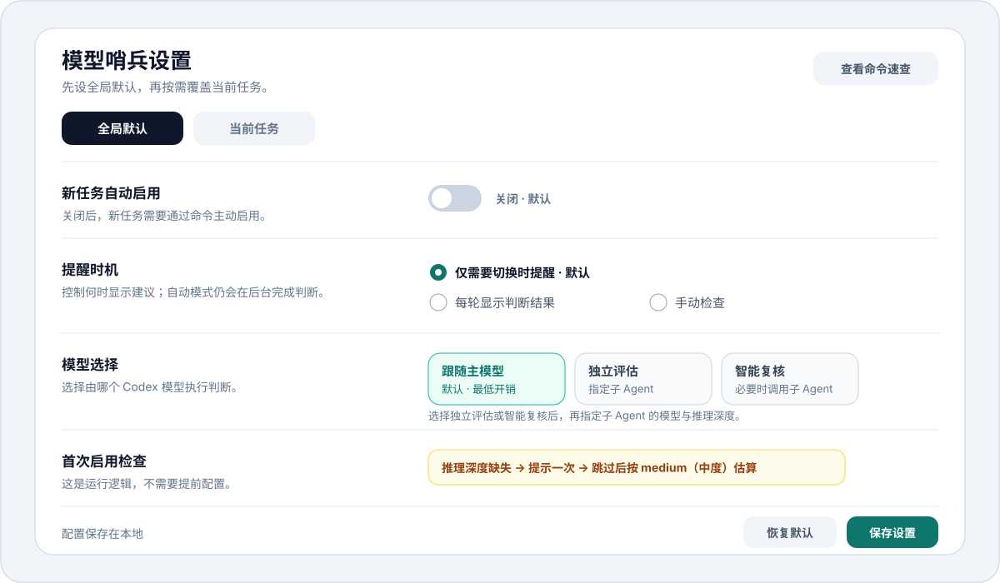

<p align="center">
  
</p>

<p align="center">
  面向 Codex 长对话和项目工作的模型选择辅助插件。
</p>

## 模型哨兵能做什么

模型哨兵是一套面向长对话与项目工作的模型决策辅助能力，通过持续评估任务需求与当前模型配置的匹配度，在关键阶段给出下一轮模型与推理深度建议。当前配置适配任务时保持静默，不干扰主任务执行。

```text
模型建议：下一轮切换至 GPT-5.6 Sol / high（高）｜任务已进入登录、支付和后端数据一致性设计。
```

核心能力包括：

- 同时推荐具体模型和推理深度。
- 识别任务从简单执行进入复杂设计、验证或高风险阶段。
- 识别长时间使用高能力模型处理重复性工作的情况。
- 支持自动提醒、手动检查和当前任务强制预检。
- 支持全局默认配置和当前任务独立配置。
- 长对话压缩后恢复监控状态。

## 先看几个实践例子

<p align="center">
  
</p>

模型哨兵始终先完成主任务，再决定是否追加下一轮建议。同一个动作也会因预计持续轮次、风险和切换成本不同而得到不同结论。

## 核心：模型原生判断引擎

模型哨兵把“是否值得切换模型”的决策直接交给模型完成。

判断模型每轮读取当前任务、项目阶段、风险、上下文负担、预计持续轮次、当前模型、当前推理深度和切换成本，直接输出：

```text
是否值得切换
推荐模型
推荐推理深度
任务阶段
判断依据
```

模型负责理解当前场景并给出结论；任务映射表、固定档位对应关系和跨级阈值不参与核心决策。程序只负责校验结果、保存状态、控制提醒节奏和处理失败回退。

这套设计带来三个价值：

1. **适应更多任务**：同一套判断维度可以覆盖开发、产品、研究、写作、设计和故障诊断。
2. **跟随模型进化**：主模型判断能力升级后，路由判断也能获得更好的上下文理解和决策能力。
3. **便于替换执行者**：未来可以接入专用路由模型，继续使用相同的输入与输出协议。

判断引擎保持可审阅：输入字段固定、输出结构固定、原因可见、提示词有版本、典型场景可以持续回归测试。

## 自动提醒工作流

<p align="center">
  
</p>

一次自动提醒的时序：

1. 用户发送本轮任务。
2. Hook 读取当前模型、插件配置和上轮状态，注入一段精简的判断上下文。
3. 模型在完成主任务的同一轮，评估下一轮是否值得调整模型或推理深度。
4. 主任务回答始终正常输出。
5. 当前档位仍然合适时不增加文案；值得切换时在末尾追加下一轮建议。
6. 响应结束后保存任务阶段和判断结果，供下一轮读取与长对话压缩后恢复。

## 插件架构

| 组件 | 职责 |
| --- | --- |
| Skill | 定义命令、判断协议和用户提示格式 |
| Hook | 读取本轮模型和任务，注入监控上下文，恢复长对话状态 |
| 状态层 | 管理全局配置、当前任务配置、提醒记录和待执行任务 |
| 判断引擎 | 组织通用输入，由模型直接输出推荐结果 |
| MCP 设置界面 | 提供可视化配置、状态查看和命令速查 |

## 判断模型的调用方式

这里配置的是“由哪个模型执行判断”，判断引擎的输入和输出协议保持一致。

| 调用方式 | 如何运行 | 额度开销 |
| --- | --- | --- |
| 跟随主模型 | 当前对话模型同时完成判断 | 最低 |
| 独立评估 | 指定 Codex 子 Agent 单独完成判断 | 较高 |
| 智能复核 | 主模型先判断，必要时调用子 Agent 复核 | 中等 |

独立判断能力无法运行时自动使用主模型完成判断，主任务继续执行。

## 额外额度开销

模型哨兵会控制注入内容和返回结构的长度。以下为当前开销预算，用于帮助使用者选择模式；实际消耗会受对话长度、模型和推理深度影响，需要通过真实 trace 持续校准。

| 运行方式 | 每次检查的额外消耗预算 | 说明 |
| --- | ---: | --- |
| 未启用或手动模式未触发 | 约 0 模型 Token | Hook 只做本地快速判断，不调用模型 |
| 跟随主模型 | 约 150–500 上下文与输出 Token | 没有额外模型请求；判断产生的额外推理量无法稳定单独拆分 |
| 独立评估 | 约 800–2,500 Token + 子 Agent 推理 Token | 每次检查会增加一次独立模型调用 |
| 智能复核 | 通常接近跟随主模型；复核轮次再叠加独立评估开销 | 仅在结论不稳定或风险较高时调用子 Agent |

简单估算公式：

```text
总额外预算 ≈ 自动检查轮次 × 跟随主模型预算 + 子 Agent 调用次数 × 独立评估预算
```

“仅需要切换时提醒”控制的是显示频率，自动模式仍会完成每轮判断，因此节省的主要是提示文本，不是判断开销。只想在不确定时检查，可以选择手动模式。

官方文档也说明，[每个子 Agent 都会独立执行模型与工具工作，因此比同类单 Agent 流程消耗更多 Token](https://learn.chatgpt.com/docs/agent-configuration/subagents)。OpenAI 建议保持提示词精简，并用代表性任务实测总 Token、质量和延迟；本项目会按这个方法持续压缩判断协议。[查看模型指导](https://developers.openai.com/api/docs/guides/latest-model)

Plus 额度无法直接按上述 Token 数换算成剩余百分比，模型哨兵也无法读取账户的实时剩余额度。这些数字用于比较模式之间的相对开销。

## 设置界面与默认值

<p align="center">
  
</p>

设置页用于管理全局默认和当前任务覆盖，并提供命令速查；界面不可用时仍可用文字命令完成相同操作。

| 设置项 | 默认值 | 可选项 |
| --- | --- | --- |
| 新任务自动启用 | 关闭 | 开启 / 关闭 |
| 提醒时机 | 仅需要切换时提醒 | 仅需要切换时提醒 / 每轮显示判断结果 / 手动检查 |
| 模型选择 | 跟随主模型 | 跟随主模型 / 独立评估 / 智能复核 |
| 独立判断模型 | 未设置 | 选择独立评估或智能复核后，指定子 Agent 的模型与推理深度 |
| 当前任务配置 | 跟随全局 | 跟随全局 / 单独覆盖 / 暂停 / 关闭 |

首次启用时，如果当前推理深度无法识别，插件会提示用户确认一次；用户跳过后按 `medium（中度）` 估算。判断失败时继续主任务；独立评估不可用时回退到跟随主模型。这些属于运行逻辑，无需用户配置。

## 命令速查

```text
$model-watch
启用当前任务

$model-watch off（关闭当前任务）
$model-watch status（查看状态）
$model-watch settings（打开设置）
$model-watch check（立即检查）
$model-watch check-inline（并行检查），<主任务>
$model-watch gate-next（强制预检），<主任务>
$model-watch sync high（同步当前推理深度）
```

命令后的中文括号属于可选说明，便于理解和记忆。

## 边界与限制

- 模型切换由用户完成。
- 自动提醒默认针对下一轮任务。
- 插件无法读取 Plus 剩余额度，也无法精确计算节省的 Token。
- Hook 可以获得当前模型；当前推理深度需要用户设置、建议推定或使用中度估算。
- 子 Agent 会增加额外额度消耗。
- 每轮最多进行一次判断。
- 判断失败时继续主任务。
- MCP 设置界面无法加载时保留文字命令。

## 隐私

- 配置、提醒记录和待执行状态保存在本地插件数据目录。
- 不采集使用统计。
- 默认不接入外部 AI 服务。
- 不保存 API Key、Token 或其他凭据。
- 待执行任务完成、取消或过期后自动清理。

## 开发与验证

仓库使用 Node.js 内置测试运行器，不需要安装第三方测试依赖：

```bash
npm test
```

测试会检查仓库必需文件、README 本地图片引用、SVG 无障碍元数据和内部发布状态文案。GitHub Actions 会在每次 push 和 pull request 时运行同一条命令。

## 仓库结构

```text
.
├── .github/workflows/validate.yml   # GitHub Actions 自动验证
├── assets/readme/                   # README 静态 SVG
├── tests/repository.test.mjs        # 仓库与文档契约测试
├── CONTRIBUTING.md                  # 贡献与隐私要求
├── LICENSE                          # MIT License
├── package.json                     # 无第三方依赖的测试入口
└── README.md                        # 产品能力、架构与使用说明
```

## 贡献

欢迎提交可复现的误判、漏判和额度开销案例，也欢迎改进判断协议、交互文案与兼容性。提交前请阅读 [CONTRIBUTING.md](./CONTRIBUTING.md)，不要在 Issue、Pull Request、日志或示例中包含私人对话、Cookie、Token、密码和其他凭据。

## License

[MIT](./LICENSE) © 2026 Shrek Wu
